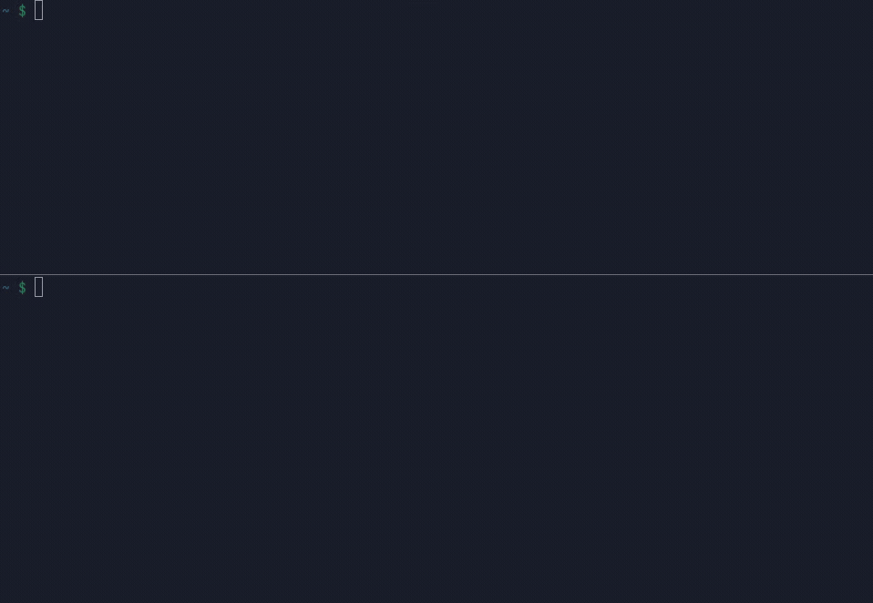

# localfwd

`localfwd` discovers listening TCP ports on an SSH host and forwards them to
your local machine through an interactive terminal UI.



## Features

- Watches for listening TCP ports on a remote host and forwards them locally.
- Lets you toggle individual forwards from the TUI with a mouse or keyboard.
- Shows the remote port, local address, state, and process name when available.
- Supports port filters and uses your existing OpenSSH configuration.

## Requirements

- An OpenSSH client on the local machine.
- `ss`, `lsof`, or `netstat` on the remote host.
- A terminal with xterm-style mouse support for clicking; all actions also have
  keyboard controls.

## Install

Download a prebuilt archive for your platform from
[GitHub Releases](https://github.com/pushpinderbal/localfwd/releases), or build
from source.

### Build from source

The repository uses [mise](https://mise.jdx.dev/) to install Go and run project
tasks:

```sh
mise trust
mise install
mise run build
install -m 0755 bin/localfwd ~/.local/bin/localfwd
```

Run the full formatting, vet, and test suite with:

```sh
mise run check
```

## Usage

Run `localfwd` on your **local machine**, using the same destination you would
pass to `ssh`:

```sh
localfwd devbox
localfwd user@192.0.2.10
```

After SSH authentication, the TUI opens and begins watching for ports. A
terminal provided by a remote development environment may itself run remotely,
so use a separate local terminal unless you have confirmed where its shell runs.

### Status

| Indicator | State | Meaning |
| --- | --- | --- |
|  | Forwarded | The remote port is available through the displayed local address. |
|  | Disabled | You manually disabled the forward; discovery will not re-enable it. |
|  | Unavailable | The remote process is no longer listening on that port. |

### Controls

| Input | Action |
| --- | --- |
| Left click | Select a port and toggle its forward. |
| `↑` / `↓` or `k` / `j` | Move the selection. |
| Mouse wheel | Move the selection through the port list. |
| Space or Enter | Toggle the selected forward. |
| `q`, Escape, or Ctrl-C | Close every forward and quit. |

### Filtering and SSH options

```sh
# Only discover selected ports and ranges.
localfwd --include 3000,4000,5173,8000-8999 devbox

# Ignore additional remote ports.
localfwd --exclude 22,5432,6379 devbox

# Keep forwards after their remote listeners stop.
localfwd --missing-scans 0 devbox

# Pass an OpenSSH option; repeat the flag for multiple options.
localfwd --ssh-option ProxyJump=bastion devbox
```

By default, `localfwd` scans every two seconds, ignores ports below 1024 and
port 22, removes a forward after three missed scans, and binds locally to
`127.0.0.1`. Run `localfwd -h` for every option.

## License

[MIT](LICENSE)
